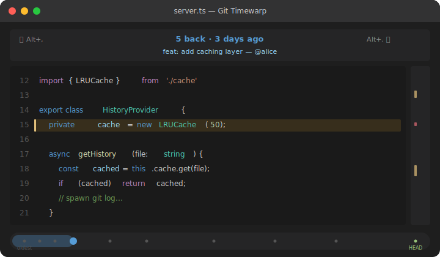
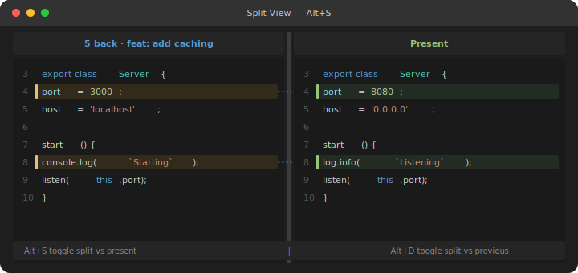
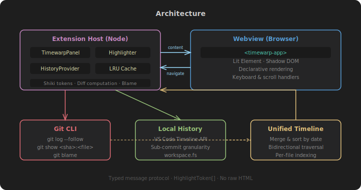

# Git Timewarp

**Navigate a file's history in-place — treating time as a navigable dimension in the editor.**

<p align="center">

</p>

Git Timewarp lets you scroll backward and forward through a file's commit history without leaving the editor. No context switching to diff views, no separate panels — just seamless time travel where you work.

---

## The Concept

Traditional git history tools pull you *away* from code — into diff viewers, blame panels, or log outputs. Git Timewarp keeps you *in* the editor and adds a temporal axis:

<p align="center">

</p>

Your scroll position is preserved across version changes — you stay anchored to the same region of code as you move through time.

---

## Features

### Time Navigation

Step through every commit that touched the current file. The editor content updates in place with syntax highlighting, preserving your viewport position.

### Diff Highlighting

Changed lines are highlighted inline. Deleted lines appear as collapsed indicators between existing lines, so you see *what changed* without a separate diff panel.

### Split View

Compare two points in time side-by-side within the same webview:

<p align="center">

</p>

### Minimap Markers

A vertical minimap shows change density across the file — green for modifications, red for deletions — so you can spot where changes cluster.

### Unified Timeline

Git commits and VS Code local history entries merge into a single ordered timeline, giving sub-commit granularity for recent changes.

### Boundary Indicators

When you reach the beginning of history or return to the present, a brief overlay confirms your position.

---

## Keyboard Shortcuts

| Action | Shortcut | Context |
|--------|----------|---------|
| Step back in history | <kbd>Alt</kbd>+<kbd>,</kbd> | Editor focused |
| Step forward in history | <kbd>Alt</kbd>+<kbd>.</kbd> | Editor focused |
| Enter scroll mode | <kbd>Alt</kbd>+<kbd>T</kbd> | Editor focused |
| Return to present | <kbd>Escape</kbd> | While time-warping |
| Split vs present | <kbd>Alt</kbd>+<kbd>S</kbd> | In timewarp view |
| Split vs previous | <kbd>Alt</kbd>+<kbd>D</kbd> | In timewarp view |
| Scroll through history | <kbd>Alt</kbd>+<kbd>Scroll</kbd> | In timewarp view |

---

## How It Works

<p align="center">

</p>

1. **History Provider** — spawns `git log --follow` to build a timeline of commits per file
2. **Content Provider** — retrieves file content at any commit via `git show`
3. **LRU Cache** — keeps recent versions in memory for instant switching
4. **Shiki Highlighter** — syntax-highlights each version with structured tokens (no raw HTML)
5. **Webview Panel** — Lit-based Shadow DOM component renders everything declaratively

---

## Configuration

| Setting | Default | Description |
|---------|---------|-------------|
| `gitTimewarp.cacheSize` | `50` | Number of file versions to keep in memory |
| `gitTimewarp.includeLocalHistory` | `true` | Include VS Code local history in timeline |
| `gitTimewarp.maxCommits` | `200` | Maximum commits to load per file |
| `gitTimewarp.debounceMs` | `150` | Delay (ms) when navigating rapidly. 0 = instant |

---

## Requirements

- VS Code 1.85+
- Git installed and accessible in PATH

---

## Installation

Search for **"Git Timewarp"** in the VS Code Extensions Marketplace, or install from the command line:

```sh
code --install-extension arcmantle.vscode-git-timewarp
```

---

## License

MIT
